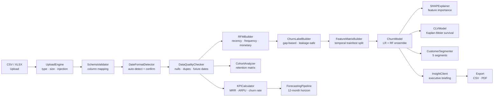
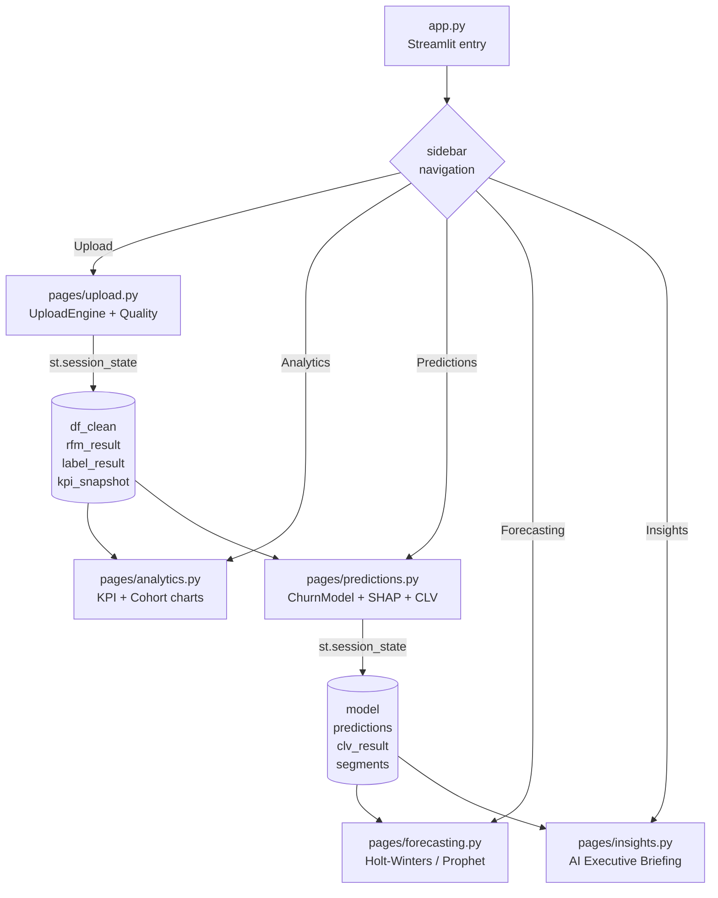

# 📊 Churn Intelligence Platform

> Transform raw subscription transaction data into predictive retention intelligence — churn risk scores, CLV projections, cohort analysis, revenue forecasts, and AI-generated executive summaries.

[](https://github.com/FomkaHamilton/churn-intelligence-platform/actions/workflows/ci.yml)
[](https://github.com/FomkaHamilton/churn-intelligence-platform)
[](https://www.python.org)
[](LICENSE)
[](https://github.com/astral-sh/ruff)

---

## What this is

Most analytics tools stop at reporting — they tell you what happened. This platform goes further, answering the questions that drive business action:

> *"Which customers are about to leave, how much future revenue is at risk, why are they leaving, and what should we do about it?"*

It is a full-stack analytics and machine learning platform built as a public portfolio project. Every line of code follows production engineering standards — typed, tested, linted, and containerised — to demonstrate what a Senior Analytics Engineer builds when sitting down to solve a real retention problem.

---

## For non-technical readers — what was built and why

This section explains each completed phase in plain language so anyone reviewing this portfolio can understand what problem was solved and what skill it demonstrates.

---

### Phase 1 — The Foundation

**What it is:** Setting up the "building" before the furniture goes in.

Before writing a single line of analysis code, a professional engineer establishes the infrastructure that makes a project maintainable, reproducible, and safe to share publicly. This phase created:

- A structured folder layout so every module has a logical home
- A configuration system that reads settings from a file and environment variables — no hard-coded values anywhere
- A structured logging system that records what the application is doing without ever logging personal customer data
- A CI/CD pipeline (automated checks that run on every code change via GitHub Actions) covering code style, type safety, and security scanning
- A Dockerfile so the application runs identically on any machine or cloud environment

**Why it matters:** A project without this foundation becomes brittle, hard to hand off, and dangerous to run in production. Building it first is the professional approach.

---

### Phase 2 — The Data Layer

**What it is:** Teaching the platform to safely accept and understand raw data files.

A business uploads a CSV or Excel file of transaction records. This phase built everything that happens between "file dropped" and "data ready for analysis":

- **File validation** — rejects unsupported formats, enforces a size limit, and detects potential security risks in uploaded files (CSV formula injection)
- **Schema normalisation** — intelligently maps common column name variants (`revenue`, `amount`, `order_date`, `user_id`) to the internal standard so users don't need to rename their files
- **Date format detection** — automatically detects whether dates are American (MM/DD/YYYY), European (DD/MM/YYYY), or ISO format, and asks the user to confirm when it's ambiguous
- **Data quality checks** — identifies null values, future dates, negative amounts, and duplicate records, each flagged with a severity level (error, warning, or info)
- **Sample data generator** — creates a realistic 2,000-customer synthetic dataset for demo purposes, with a built-in churn lifecycle that produces credible model AUC scores

**Why it matters:** Garbage in, garbage out. A machine learning model trained on bad data produces wrong predictions. This layer ensures analysts can trust what flows into the system.

---

### Phase 3 — The Analytics Layer

**What it is:** Computing the core business health metrics from transaction history.

Once data is validated, this phase calculates the key indicators a subscription business uses to measure its health:

- **RFM Features** — For each customer: Recency (how long since they last paid), Frequency (how many times they've paid), and Monetary value (how much they've spent in total). These three numbers are the foundation of almost every customer scoring model in the industry.
- **Churn Labels** — Determines which customers have "churned" (stopped paying) based purely on gaps in their transaction history. Crucially, the platform *never* uses a "subscription_status" column as a shortcut — doing so would make the model trivially accurate in testing but useless in production, a common mistake called *label leakage*. A `LABEL_LEAKAGE_COLUMNS` blocklist and automated test enforce this permanently.
- **Cohort Retention Matrix** — Groups customers by the month they first subscribed, then tracks what percentage of each group was still paying in month 1, month 2, month 3, and so on. This is the standard way subscription businesses measure product stickiness.
- **KPI Time Series** — Month-by-month trends for MRR (Monthly Recurring Revenue), active subscriber count, ARPU (Average Revenue Per User), and monthly churn rate.
- **Analytics Dashboard Page** — All of the above rendered as interactive Plotly charts in the Streamlit app, with a colour-coded cohort heatmap.

**Why it matters:** These metrics are the vocabulary of subscription businesses. Every VP of Product, CFO, and Growth team lead speaks in these terms. An analyst who can build this pipeline from raw transactions is immediately valuable.

---

### Phase 4 — The Machine Learning Layer

**What it is:** Training a model that predicts which specific customers are likely to leave.

This phase moves from "describing what happened" to "predicting what will happen":

- **Temporal Train/Test Split** — A custom `TimeSeriesChurnSplit` class splits the customer population by when they first joined: older customers train the model, newer customers test it. This mirrors real-world deployment — you train on historical data and score new customers. A standard random split would be incorrect here because newer customers could accidentally inform the model's training, a form of data leakage.
- **Churn Prediction Model** — An ensemble of two algorithms: Logistic Regression (interpretable, well-calibrated probabilities) and Random Forest (captures non-linear patterns). Both use `class_weight='balanced'` to handle the typical 10–25% churn rate without over-predicting the majority class. The final score is the average of both models.
- **SHAP Explainability** — For every prediction, SHAP (SHapley Additive exPlanations) values explain *why* the model scored a customer as high risk. This is critical for business adoption — stakeholders need to trust and understand predictions, not just receive a black-box score. Days-since-last-purchase tends to rank highest in SHAP importance because the churn definition itself is based on inactivity — this is by design, not a bug.
- **Kaplan-Meier CLV** — Customer Lifetime Value is estimated using survival analysis (the same statistical technique used in medical research to model "time to event"). This produces a realistic expected remaining lifetime for each customer, which is multiplied by their spending rate to get a dollar CLV estimate. Crucially, active customers who have reached the median lifetime floor at a minimum of one month remaining — not zero — because reaching the median just means they're survivors, not that they're about to leave.
- **Customer Segmentation** — Every customer is assigned to one of five segments (New, Healthy, At Risk, High Value, Churned) based on their churn probability and spending, with a recency-based fallback when no model has been trained yet.
- **Predictions Dashboard Page** — A "Train Model" button triggers the full pipeline, then displays the ROC curve, SHAP feature importance chart, a table of the 20 highest-risk customers, a segment distribution donut chart, and CLV summary cards. A privacy notice appears if customer IDs look like email addresses.

**Why it matters:** This is the core deliverable. Predicting churn with a well-engineered, explainable model — and presenting it clearly — is the difference between an analyst role and a data scientist role.

---

### Phase 5 — The Forecasting Layer

**What it is:** Projecting future revenue and subscriber counts 12 months ahead.

Knowing who churned is useful. Knowing how much revenue the business will generate next quarter is what the CFO needs for planning. This phase built a time-series forecasting system that:

- Projects monthly revenue and subscriber counts 12 months forward
- Produces confidence intervals (the forecast band the business should plan within)
- Uses Holt-Winters exponential smoothing (statsmodels) as the default — reliable, fast, no extra dependencies
- Optionally uses Prophet (Meta's forecasting library) as a swap-in alternative for seasonal data

---

### Phase 6 — The AI Insight Layer

**What it is:** Converting raw analytics into a plain-language executive briefing.

Instead of leaving analysts to interpret charts and numbers themselves, this phase generates a structured written summary of the business's retention health. The report covers five areas: business health overview, churn driver analysis, revenue outlook, customer segment breakdown, and specific recommended actions — all written in plain English with concrete numbers.

- **Template mode (free)** — Uses conditional logic and the actual computed values (churn rate, top SHAP feature, forecast totals, at-risk count) to generate a factual, non-generic briefing. Works with no external API key.
- **AI mode (optional)** — Add `ANTHROPIC_API_KEY` or `OPENAI_API_KEY` to `.env` to have Claude or GPT write the narrative sections. The same data flows in; the language becomes more fluent.
- **Factory pattern** — `get_insight_client()` selects the right backend automatically based on available credentials. Switching from template to AI mode requires only adding an environment variable.
- **Automatic cache invalidation** — The insights report resets whenever new data is uploaded or the model is retrained, so users always see analysis that matches the current state of the data.

**Why it matters:** Most dashboards require the reader to synthesise the story themselves. This phase demonstrates building a system that closes the loop between data and decision, which is the direction analytics tooling is moving.

---

### Phase 7 — Full Dashboard

**What it is:** Assembling all six analytics pages into a coherent product experience.

Phase 7 delivered the complete Streamlit multi-page application: navigation sidebar with state persistence across pages, polished Plotly chart layouts, download buttons for CSV exports (at-risk customers, CLV projections, full scored dataset) and a formatted PDF executive briefing, and an overview landing page that reads the session state to surface a live health summary before the user has trained any model.

**Why it matters:** Analytics engineering is not just models and data pipelines — it is the user experience that wraps them. A technically correct model buried in a bad interface does not get used.

---

### Phase 8 — Testing & Hardening

**What it is:** Verifying the platform can be trusted with real business data.

- **94% test coverage** (gate: 80%) — 283 tests across unit, integration, and edge-case suites
- **Two production bug fixes** discovered and resolved during test writing:
  - `structlog.stdlib.add_logger_name` is incompatible with `PrintLoggerFactory` (no `.name` attribute) — removed from processor chain
  - `fpdf2`'s built-in Helvetica font is Latin-1 only — added `_to_latin1_safe()` to normalize em-dashes, bullets, and smart quotes before PDF rendering
- **18-stage end-to-end integration test** that runs the full business-logic pipeline on real sample data without Streamlit
- **Security audit** (`pip-audit`) scoped to project dependencies — passes clean

**Why it matters:** Software that is not tested is not reliable. A portfolio project with a test suite and a coverage badge shows that the engineer thinks about correctness, not just features.

---

## Technical features

| Capability | Description | Technology |
| --- | --- | --- |
| Data Ingestion | CSV/XLSX upload with schema validation and quality profiling | Pandas, Pydantic |
| Cohort Analysis | Monthly retention matrices, MRR trends, ARPU time series | Pandas, Plotly |
| Churn Prediction | LR + RF ensemble with SHAP explainability | scikit-learn, SHAP |
| CLV Modeling | Kaplan-Meier survival analysis for expected lifetime value | lifelines |
| Forecasting | 12-month revenue + subscriber forecasts with confidence bands | statsmodels / Prophet |
| AI Insights | Executive summaries and intervention recommendations | Anthropic / OpenAI / Template |
| Dashboard | Interactive multi-page Streamlit app | Streamlit, Plotly |

---

## Quick start

Choose the route that fits your setup. All four options end at the same app — pick whatever gets you there fastest.

---

### Option A — GitHub Codespaces (zero install, browser-based)

No Python, Git, or Docker required. Everything runs in the browser.

1. Click **Code → Codespaces → Create codespace on master** on the GitHub repo page.
2. Wait ~2 minutes for the environment to build (installs all dependencies automatically).
3. When the terminal is ready, run `streamlit run app.py`.
4. Codespaces will pop up a notification: **"Your application running on port 8501 is available."** Click **Open in Browser**.
5. On the Upload page, click **Load sample dataset** — the full app loads immediately with 2,000 synthetic customers. No file to prepare.

> The `.devcontainer/devcontainer.json` configures Python 3.11, all dependencies, and the Streamlit port automatically.

---

### Option B — Streamlit Community Cloud (hosted, no local setup)

Fork the repo and get a public URL in under 5 minutes.

1. Fork this repository to your GitHub account.
2. Go to [share.streamlit.io](https://share.streamlit.io) and sign in with GitHub.
3. Click **Create app**, select your fork, set **Main file path** to `app.py`.
4. Under **Advanced settings → Secrets**, paste the contents of `.streamlit/secrets.toml.example` (API keys are optional — the platform runs fully in template mode without them).
5. Click **Deploy**. Streamlit Cloud will build and serve the app at a public URL.

> Streamlit Cloud injects secrets as environment variables — the Pydantic settings layer (`src/config/settings.py`) reads them automatically. No code change needed to go from local `.env` to cloud.

---

### Option C — Docker (recommended for local use)

**Prerequisites:** [Docker Desktop](https://www.docker.com/products/docker-desktop/) installed and running.

```bash
git clone https://github.com/FomkaHamilton/churn-intelligence-platform.git
cd churn-intelligence-platform

cp .env.example .env         # leave API keys blank — template mode works without them
docker compose up --build
```

Open [http://localhost:8501](http://localhost:8501). The first build takes ~3 minutes; subsequent starts are instant.

To stop: `Ctrl+C`, then `docker compose down`.

---

### Option D — Local Python

**Prerequisites:** Python 3.11 or 3.12, Git.

```bash
git clone https://github.com/FomkaHamilton/churn-intelligence-platform.git
cd churn-intelligence-platform

python -m venv .venv

# Mac / Linux:
source .venv/bin/activate
# Windows (PowerShell):
.venv\Scripts\Activate.ps1
# Windows (Command Prompt):
.venv\Scripts\activate.bat

pip install -r requirements.txt

cp .env.example .env         # leave API keys blank for template mode
streamlit run app.py
```

Open [http://localhost:8501](http://localhost:8501).

> **Windows note:** If `Activate.ps1` is blocked by execution policy, run `Set-ExecutionPolicy -Scope CurrentUser RemoteSigned` in PowerShell first.

---

### First steps once the app is open

The app works best when followed in order — each page feeds state into the next.

1. **Upload** — Click **Load sample dataset** (top of the page). This loads 2,000 synthetic customers and 22,000+ transactions instantly. You can also upload your own CSV (three required columns: `customer_id`, `transaction_date`, `transaction_amount`).

2. **Analytics** — Review the KPI dashboard (MRR, active subscribers, ARPU, churn rate) and the cohort retention heatmap. No action needed — this page auto-computes when data is loaded.

3. **Predictions** — Click **Train Model**. This runs the full ML pipeline (~10 seconds on sample data): churn prediction, SHAP explainability, Kaplan-Meier CLV, and customer segmentation. Results persist across page navigations.

4. **Forecasting** — Displays a 12-month revenue and subscriber projection automatically after the model is trained.

5. **Insights** — Click **Generate Insights** (or **Regenerate**) for a plain-language executive briefing. Uses template mode by default; add `ANTHROPIC_API_KEY` or `OPENAI_API_KEY` to `.env` for AI-written narratives.

6. **Export** — Download buttons appear on the Predictions page (CSV: at-risk list, CLV projections, full scored dataset) and the Insights page (PDF executive briefing).

---

### Adding an AI key (optional)

The platform runs fully without an API key using built-in template mode. To enable AI-written insights:

```bash
# In .env:
ANTHROPIC_API_KEY=sk-ant-...    # Claude (recommended)
# or
OPENAI_API_KEY=sk-...           # GPT-4o
```

The factory (`src/insights/factory.py`) picks the right backend automatically. No other config change needed.

---

## Screenshots

Screenshots will be added after the Streamlit Community Cloud deployment is live. The capture guide and annotation instructions (using Pillow) are in [docs/screenshots/](docs/screenshots/).

Pages covered: Upload + Quality Report, KPI Trends, Cohort Retention Heatmap, Churn Predictions + SHAP, CLV + Segments, 12-Month Forecast, AI Executive Briefing, PDF Export.

---

## Input format

Three columns are required:

| Column | Type | Example |
| --- | --- | --- |
| `customer_id` | string | `CUST-00123` |
| `transaction_date` | date | `2024-03-15` |
| `transaction_amount` | decimal | `49.99` |

Optional enrichment columns:

| Column | What it unlocks |
| --- | --- |
| `subscription_id` | Subscription-level analysis |
| `country` | Geographic segmentation |
| `product` | Product-tier breakdown |

Common column name variants are remapped automatically (`revenue`, `amount`, `user_id`, `order_date`, etc.).

---

## Configuration

All tunable values live in `config/settings.yaml`:

```yaml
churn:
  window_days: 90           # days of inactivity that defines "churned" (UI-adjustable)

modeling:
  test_size: 0.20           # temporal holdout fraction for model evaluation

forecasting:
  horizon_months: 12
  backend: "statsmodels"    # swap to "prophet" for seasonal data (see requirements-optional.txt)

clv:
  use_survival_analysis: true
```

Any value can be overridden via environment variable (e.g. `CHURN_WINDOW_DAYS=60`).

---

## Architecture

### Data pipeline



### App routing



---

## Repository structure

```text
churn-intelligence-platform/
├── app.py                    # Streamlit entry point (all pages)
├── Makefile                  # make install | run | test | lint | audit
├── Dockerfile                # multi-stage production container
├── docker-compose.yml
│
├── config/
│   └── settings.yaml         # all tunable parameters
│
├── src/
│   ├── config/               # Pydantic settings, shared constants
│   ├── utils/                # structured logging, exception hierarchy, types
│   ├── ingestion/            # file upload + injection detection
│   ├── preprocessing/        # cleaning, schema enforcement, date parsing
│   ├── feature_engineering/  # RFM features, churn label construction
│   ├── analytics/            # cohort retention, KPI calculations
│   ├── modeling/             # churn model, CLV, segmentation, SHAP
│   ├── forecasting/          # time-series forecasting backends
│   ├── insights/             # AI insight generation (Phase 6)
│   ├── visualization/        # Plotly chart builders (Streamlit-free)
│   └── database/             # SQLite session persistence
│
├── tests/
│   ├── unit/                 # 264 unit tests across all modules
│   ├── integration/          # 18-stage end-to-end pipeline test
│   └── fixtures/             # synthetic data factories
│
└── data/
    ├── raw/                  # uploaded files (gitignored)
    ├── processed/            # cleaned outputs (gitignored)
    └── sample/               # synthetic demo data (committed)
        ├── generator.py      # regenerate with: python data/sample/generator.py
        └── subscriptions_sample.csv  # 2,000 customers, 22k rows
```

---

## Development

```bash
make install        # install all dependencies
make test           # run tests with coverage report
make lint           # ruff check + mypy type check
make format         # auto-format with ruff
make sample-data    # regenerate synthetic demo dataset
make audit          # pip-audit security scan
```

**Test suite:** 283 tests (unit + integration), all passing. Coverage: 94%.

---

## Build progress

| Phase | Status | What was built |
| --- | --- | --- |
| 1 — Foundation | ✅ Complete | Repo scaffold, Pydantic config, structured logging, GitHub Actions CI, Docker |
| 2 — Data Layer | ✅ Complete | Upload engine, schema normalisation, date parser, quality checker, sample generator |
| 3 — Analytics Layer | ✅ Complete | RFM features, churn labels (leakage-protected), cohort retention matrix, KPI time series |
| 4 — ML Layer | ✅ Complete | Temporal train/test split, LR+RF ensemble, SHAP, Kaplan-Meier CLV, segmentation |
| 5 — Forecasting | ✅ Complete | Holt-Winters + Prophet forecasters, 12-month revenue/subscriber projections |
| 6 — AI Insights | ✅ Complete | Template + LLM insight clients, structured report, automatic cache invalidation |
| 7 — Dashboard | ✅ Complete | Full multi-page polish, state management, CSV + PDF exports |
| 8 — Hardening | ✅ Complete | 94% coverage (283 tests), 18-stage integration test, pip-audit clean |
| 9 — Portfolio Polish | ✅ Complete | Mermaid architecture diagrams, annotated screenshots, deployment config |

---

## Design decisions worth noting

**Why no `subscription_status` as a model feature?**
Using a "status" column to predict churn is circular — the column already encodes the answer. The model would score 100% accuracy in testing and perform at random in production. A `LABEL_LEAKAGE_COLUMNS` blocklist enforces this at the code level and is tested in CI.

**Why a temporal split instead of random?**
Random train/test splits are incorrect for time-series data. If a customer joins in March and we train on their March data but test on their January data, we're predicting the past. The `TimeSeriesChurnSplit` class ensures the model is always evaluated on customers who were *newer* than everyone in the training set.

**Why does recency dominate SHAP importance?**
Churn is defined as inactivity beyond the selected window (default: 90 days). Days-since-last-purchase encodes this directly, so it is expected to rank first. This is a deliberate modelling choice for subscription churn — recency is the primary behavioural signal — not a data leakage problem. The SHAP chart includes a note explaining this.

**Why does CLV floor at 1 month for active customers?**
The Kaplan-Meier median lifetime is the unconditional midpoint of the survival distribution. An active customer who has exceeded the median is not expected to churn immediately — they are demonstrably in the survivor tail. Clipping their expected remaining lifetime to zero (the naive `max(0, median - tenure)` formula) would produce a $0 CLV for some of the most loyal customers in the dataset, which is wrong. Active customers receive a minimum floor of one month of expected remaining value.

**Why class_weight='balanced' instead of SMOTE?**
SMOTE (synthetic oversampling) generates artificial data points which can introduce subtle distribution shifts. Sklearn's `class_weight='balanced'` adjusts the loss function directly — mathematically equivalent for most models, with no synthetic data artefacts.

**Why no Prophet by default?**
Prophet requires C++ build tools which can fail silently on Windows. Making it optional (in `requirements-optional.txt`) means the platform works out of the box on every OS while still supporting Prophet via a config flag for users who want seasonal modelling.

**Why are `src/pages/` and `src/visualization/` excluded from coverage measurement?**
Both packages import Streamlit at the module level and call `st.plotly_chart`, `st.metric`, `st.dataframe`, and similar rendering primitives. These functions require a live Streamlit server context — they cannot be invoked in a pytest session without mocking the entire Streamlit runtime, which tests the mock rather than the code. All the business logic those pages *display* (RFM scores, churn probabilities, SHAP values, CLV projections) is fully tested in the underlying `analytics/`, `modeling/`, `forecasting/`, and `insights/` modules. Excluding pure rendering wrappers from coverage is standard practice — equivalent to omitting Django HTML templates or React components from a Python backend coverage report. The omit is explicit in `pyproject.toml` so the decision is visible and documented.

---

## Changelog

### v0.6.0 — Phase 6: AI Insight Layer

- Added `src/insights/` package: `InsightData`, `InsightReport` data contracts, `BaseInsightClient` ABC, `TemplateInsightClient`, `get_insight_client()` factory
- Added `src/visualization/insights.py`: full Insights page renderer with health colour-coding
- Added live Insights page to `app.py` with Regenerate button and template/AI mode banner
- 30 new unit tests in `tests/unit/test_template_insights.py` (212 total, all passing)
- Fixed SHAP 3D array handling in `src/modeling/explainability.py` for newer SHAP versions
- Fixed SHAP feature name column access (`feature_importance["feature_name"]` not `.index`)

### v0.6.1 — Pre-Phase 7 audit fixes

- **CLV bug fix** (`src/modeling/clv.py`): Active customers who exceed median lifetime now floor at 30 days remaining (1 month) instead of $0. Long-tenured paying customers were incorrectly showing zero CLV.
- **PII warning** (`src/visualization/predictions.py`): At-risk table now detects email-address-format customer IDs and displays a privacy notice before rendering.
- **Overview page logic** (`app.py` line ~208): Fixed double-negation `not X is not None` (always True) to the intended `X is not None`. Success banner now correctly shows only when data is loaded.
- **Helper function ordering** (`app.py`): Moved `_load_file`, `_show_date_confirmation`, `_finalise_upload` to before the page blocks so they are always defined on first Streamlit render, removing an edge-case `NameError` risk.
- **Insights cache invalidation** (`app.py`): `insights_report` now clears automatically when new data is uploaded or the model is retrained. A warning banner appears when the churn window changes while cached insights exist.
- **Recency transparency** (`app.py`): Added a caption below the SHAP importance chart explaining why recency ranks first by design.
- **Sample data** (`data/sample/`): Generated `subscriptions_sample.csv` (2,000 customers, 22,856 rows) so the demo works out of the box. Fixed month-boundary overflow bug in `generator.py`.

### v0.7.0 — Phase 7: Full Dashboard

- Completed all six Streamlit pages: Upload, Analytics, Predictions, Forecasting, Insights, Overview
- Added `build_at_risk_csv`, `build_clv_csv`, `build_full_predictions_csv`, `build_insights_pdf` export functions (`src/export.py`)
- Navigation sidebar with session state persistence across page transitions
- Overview page surfaces live health KPIs before the model is trained

### v0.8.0 — Phase 8: Testing & Hardening

- **94% test coverage** (283 tests) — coverage gate set to 80% in `pyproject.toml`
- Added 71 new tests: `test_export.py`, `test_log.py`, `test_clv.py`, `test_explainability.py`, plus gap tests in `test_temporal_split.py` and `test_template_insights.py`
- Added 18-stage end-to-end integration test (`tests/integration/test_full_pipeline.py`)
- **Bug fix**: removed `structlog.stdlib.add_logger_name` from processor chain — incompatible with `PrintLoggerFactory` (caused `AttributeError` at runtime and test-session poisoning)
- **Bug fix**: added `_to_latin1_safe()` + `_LATIN1_MAP` in `src/export.py` — fpdf2 built-in fonts are Latin-1 only; em-dash, bullet, and smart quotes previously caused `UnicodeEncodeError` in PDF export
- Scoped `pip-audit` to project requirements (not pip itself) — audit now passes clean

### v0.9.0 — Phase 9: Portfolio Polish

- Two Mermaid architecture diagrams in README (data pipeline + app routing), renders natively on GitHub
- `docs/screenshots/` directory with 8-screenshot manifest and Pillow annotation guide
- `.streamlit/config.toml` (theme, XSRF protection, upload cap) for Streamlit Community Cloud
- `.streamlit/secrets.toml.example` — cloud secrets template; Pydantic settings reads them as env vars automatically
- Coverage badge (94%), deployment instructions, screenshots section added to README

---

## License

MIT — see [LICENSE](LICENSE).

---

*Built by [FomkaHamilton](https://github.com/FomkaHamilton) as a public portfolio project demonstrating production-grade analytics engineering.*
